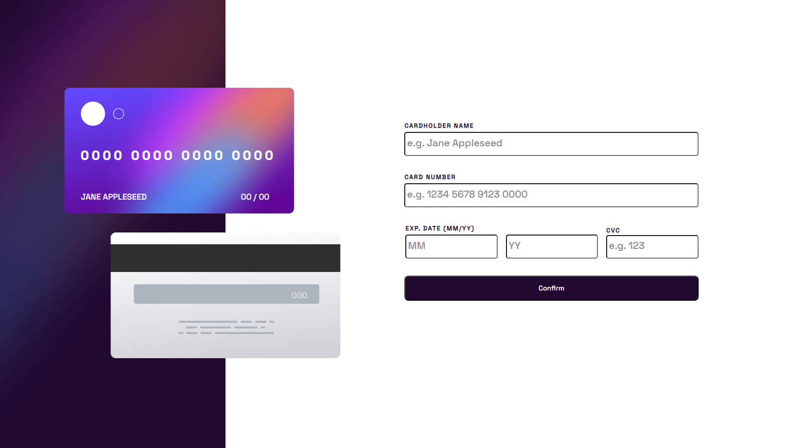

# Frontend Mentor - Interactive card details form solution

An interactive credit card payment component project completed as part of the Frontend Mentor challenges. This project involves building a component that simulates a credit card payment form. The credit card visualization updates as the user fills out the form fields. The project is developed using HTML, CSS, and JavaScript to provide an engaging and dynamic user experience.

## Features

- Interactive component that simulates a credit card payment form.
- Utilizes JavaScript to update the credit card visualization as the user fills out the form fields.
- Provides an engaging and dynamic user interaction.

## Technologies Used 🛠️

-  HTML5: Markup language for structuring the web page.
-  CSS3: Styling language for design and presentation.
-  JavaScript: Programming language for interactivity and user interactions.

## User Interaction and Credit Card Visualization

- The interactive component provides a credit card payment form.
- The credit card visualization updates in real-time as the user fills out the form fields.

## Usage Instructions

1. Clone this repository to your local machine.
2. Open the `index.html` file in your web browser to interact with the credit card payment component.
3. Fill out the form fields to see the credit card visualization update in real-time.

## Customization

Feel free to customize and enhance the interactive credit card payment component according to your preferences:

- Modify the styling and layout of the form and credit card visualization.
- Add validation or additional features to the form for a more robust user experience.
- Experiment with different animations or transitions to enhance the visual appeal.

## Author ✒️

- **Carmenyo** - [Carmenyo](https://github.com/carmenyo)

## Acknowledgments

I would like to thank Frontend Mentor for providing challenging projects that help improve my frontend development skills.

